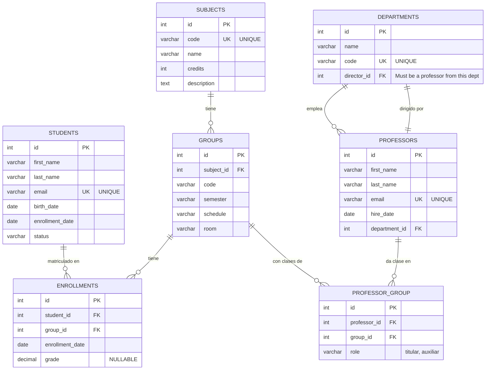

# Diagrama Entidad-Relacion

```mermaid
erDiagram
    STUDENTS ||--o{ ENROLLMENTS : "matriculado en"
    GROUPS ||--o{ ENROLLMENTS : "tiene"
    SUBJECTS ||--o{ GROUPS : "tiene"
    PROFESSORS ||--o{ PROFESSOR_GROUP : "da clase en"
    GROUPS ||--o{ PROFESSOR_GROUP : "con clases de"
    DEPARTMENTS ||--o{ PROFESSORS : "emplea"
    DEPARTMENTS ||--|| PROFESSORS : "dirigido por"

    STUDENTS {
        int id PK
        varchar first_name
        varchar last_name
        varchar email UK "UNIQUE"
        date birth_date
        date enrollment_date
        varchar status
    }

    PROFESSORS {
        int id PK
        varchar first_name
        varchar last_name
        varchar email UK "UNIQUE"
        date hire_date
        int department_id FK
    }

    DEPARTMENTS {
        int id PK
        varchar name
        varchar code UK "UNIQUE"
        int director_id FK "Must be a professor from this dept"
    }

    SUBJECTS {
        int id PK
        varchar code UK "UNIQUE"
        varchar name
        int credits
        text description
    }

    GROUPS {
        int id PK
        int subject_id FK
        varchar code
        varchar semester
        varchar schedule
        varchar room
    }

    ENROLLMENTS {
        int id PK
        int student_id FK
        int group_id FK
        date enrollment_date
        decimal grade "NULLABLE"
    }

    PROFESSOR_GROUP {
        int id PK
        int professor_id FK
        int group_id FK
        varchar role "titular, auxiliar"
    }
```